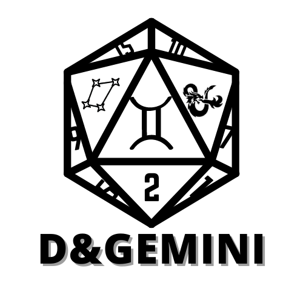

# D&Gemini

D&Gemini é um website projetado para oferecer suporte e melhorar a experiência dos jogadores de RPG de mesa, especialmente voltado para Dungeons & Dragons (D&D).

O projeto visa integrar inteligência artificial para proporcionar funcionalidades que auxiliam mestres e jogadores durante suas sessões de RPG, promovendo uma jogabilidade mais fluida e imersiva.

## Funcionalidades Principais

- **Gerador de Ambientação**: Utilização de IA para criar as características do mundo.
  
- **Gerador de Encontros**: Ferramenta para criar encontros balanceados com base no nível e na composição do grupo de jogadores.
  
- **Gestão de Personagens**: Capacidade de criar e gerenciar fichas de personagens, incluindo armazenamento de informações importantes.

## Como Usar

1. **Instalação**:
   - Clone o repositório para sua máquina local.
   - Execute `npm install` para instalar as dependências necessárias.

2. **Configuração**:
   - Configure as variáveis de ambiente necessárias conforme descrito no arquivo `.env.example`.

3. **Execução**:
   - Inicie o servidor local com `npm start`.
   - Acesse o website através do navegador usando o endereço local indicado.
